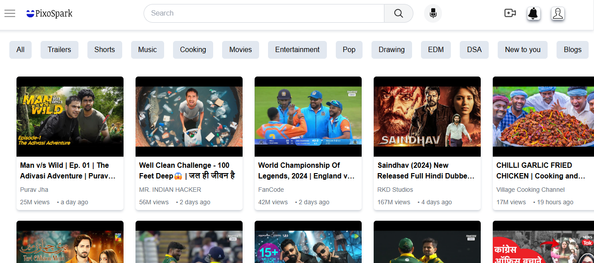
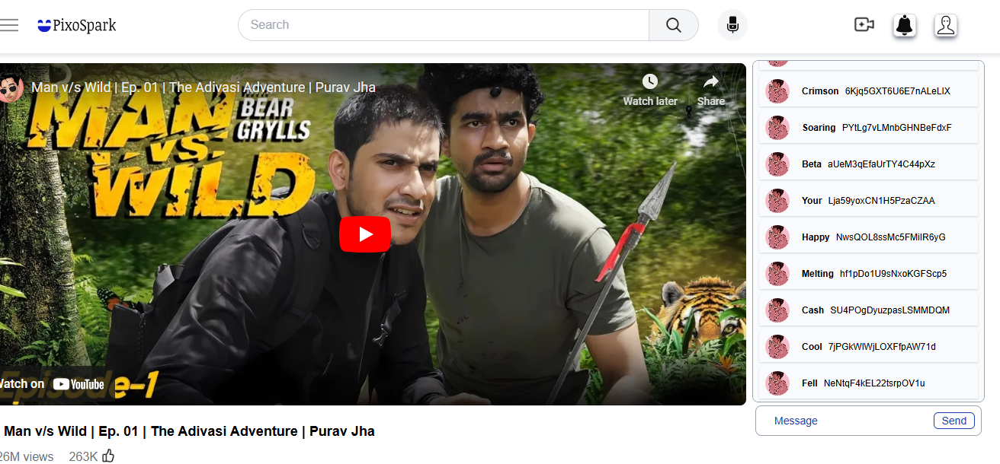

# PixoSpark
### Created Using React + vite + tailwind Css + Redux + youtube api
- UI - Sidebar, Search bar ,ButtonList on top, mainContainer.
  Sidebar uses api for each div
- mainContainer - Contain Cards.
- Onclick Card - takes to respective Watch page.
- Watch page UI - Video container , Comment Section , Live comment Section(also contain input text bar). 
# 
#### Special features:
* SearchBar - used searchApi that displays the search suggestions.(Search api need Cors pluglin or extension in ur chorme);

* Live Comment Section(api polling) - generates messages randomly that dispatches after every 500milliseconds and message can also be inputed in between liveChats.

### Run the project using cmd:
* npm run dev 

## Home Page:

## Browse Page:

## Search bar:

### Get CORS plugin for Search bar :
https://chromewebstore.google.com/detail/allow-cors-access-control/lhobafahddgcelffkeicbaginigeejlf
 
### Keep coding💙.